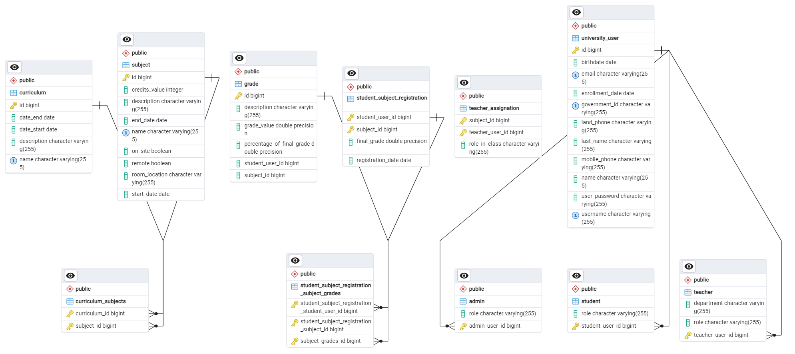
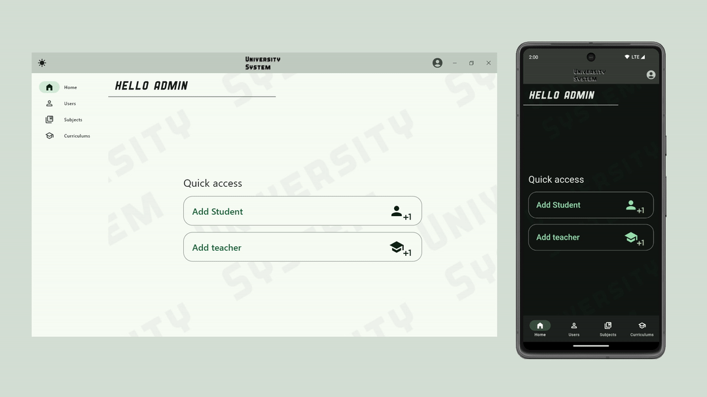

  

University System
---
University System is a Spring Boot application designed for managing university operations with distinct user flows based on roles. it leverages industry best practices and modern technologies to deliver a robust and scalable solution.

Key Features
---
- JSON Web Token (JWT) based Authentication.
- Developed with Clean Code and SOLID principles for maintainable and extensible code.
- User roles with method-level security using Spring Security.
- REST API compliant with best practices.
- GraphQL API for select Services.
- Layered DAO, Service, Controller architecture for clear separation of concerns.
- Java Streams for optimized and understandable data manipulation.
- Docker and Docker Compose containerization.
- Database-agnostic design using JPQL and Hibernate ORM.
- Robust field validation using Hibernate Validator to ensure data integrity.
- Automatic database schema generation for simplified setup and updates.
- Bean boilerplate reduction with Lombok.
- Serialization and mapping using MapStruct.
- Unit and Integration tests using JUnit and Mockito.

Technology Stack
---
- Programming Language: Java
- Framework: Spring Boot
- Security: Spring Security, JWT
- Build Tool: Maven
- Data Access: Spring Data JPA, Hibernate ORM
- Utilities: Lombok, MapStruct
- Database: PostgreSQL
- APIs: REST, GraphQL
- Containerization: Docker, Docker Compose
- API Documentation: OpenAPI (Swagger, Postman, Bruno)
- Testing Frameworks: JUnit, Mockito

Database Schema
---
<picture>
  <source media="(prefers-color-scheme: dark)" srcset="./readmeAssets/DB_schema.png">
  
</picture>

UI Implementation
---
See [University System UI](https://github.com/kberriom/UniversitySystemFront) for more information on the client UI implementation.

<picture>
  <source media="(prefers-color-scheme: dark)" srcset="./readmeAssets/intro_dark_mode.gif">
  
</picture>